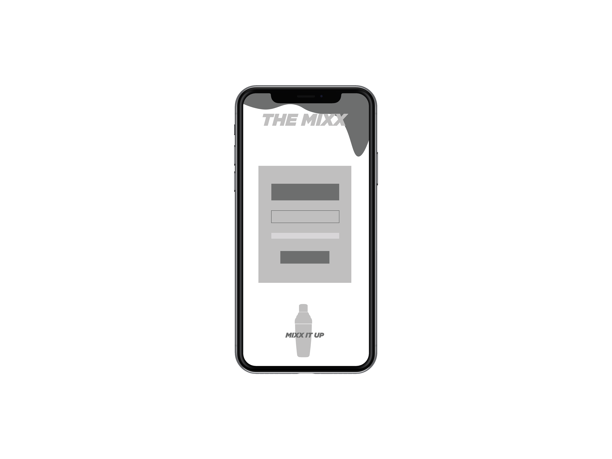
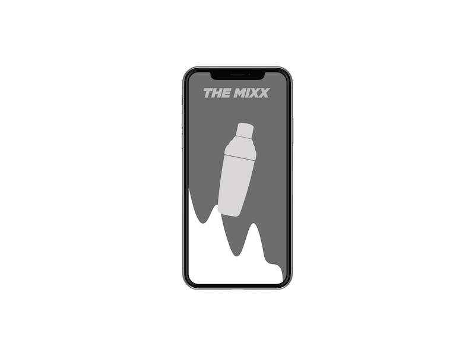
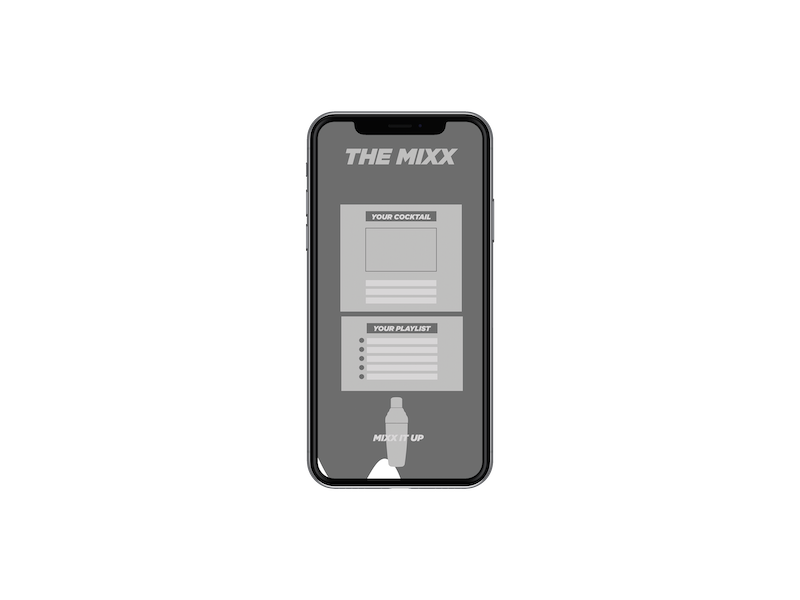

# Shake it! - Mix-a-Lot

## DESCRIPTION

Set your party in autopilot with the shake it/mix app so that you can enjoy time with friends.
The app generates cocktail recipes and 

User can input their liquor of choice and music keyword of choice
It will bring up one cocktail recioe and generate a playlist for them.

## USER STORY

AS A party host
I WANT convenient access to cocktail recipes and music playlists
SO THAT I can spend more time enjoying the party rather than running it

## FRAMEWORK

zurb foundation

https://get.foundation/

## WIREFRAMES

## APIS

Pulling cocktail information
https://www.thecocktaildb.com/api.php

Pulling our music choices 
https://www.mixcloud.com/developers/
